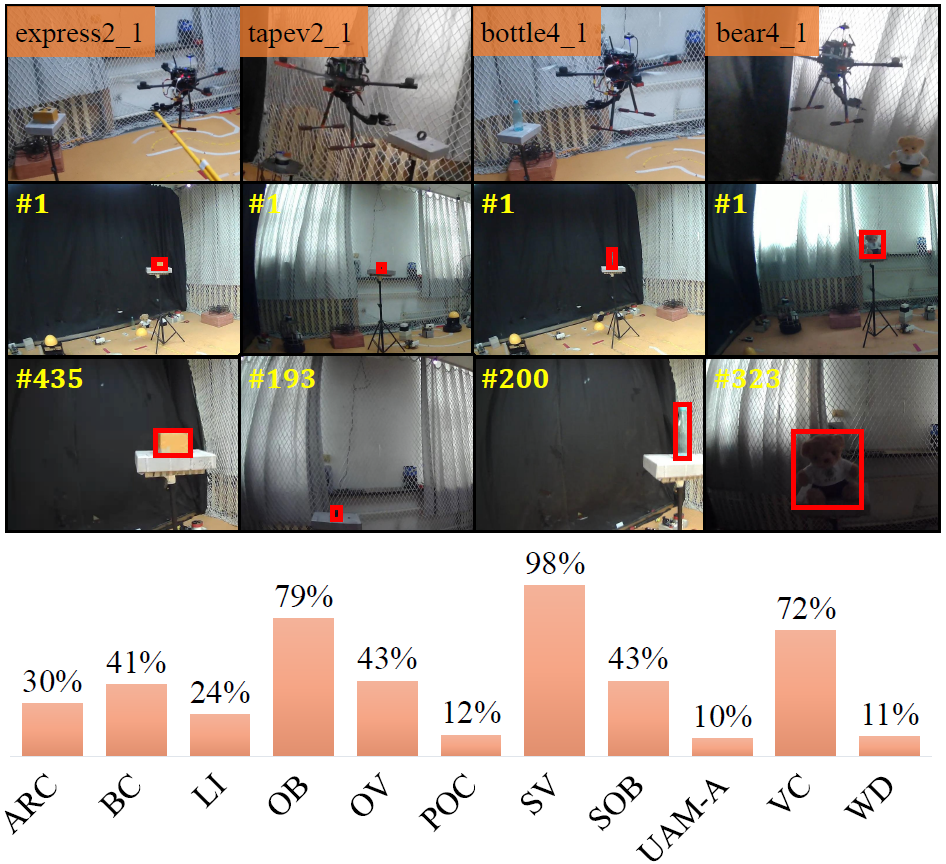

# SiamSA: Robust Siamese Object Tracking for Unmanned Aerial Manipulator

## Demo video

Our [video](https://youtu.be/XsWBu9hoJp0) demonstrates the evaluation of SiamSA and other 4 state-of-the-art trackers on UAV123@10fps and UAMT100 benchmark. Real-world tests of SiamSA on a flying UAM platform form first and third perspective are also involved.

## Environment setup
This code has been tested on Ubuntu 18.04, Python 3.8.3, Pytorch 0.7.0/1.6.0, CUDA 10.2.
Please install related libraries before running this code: 

```bash
pip install -r requirements.txt
```

## Test
Download pretrained model and put it into `tools/snapshot` directory.

Download testing datasets and put them into `test_dataset` directory. If you want to test the tracker on a new dataset, please refer to [pysot-toolkit](https://github.com/StrangerZhang/pysot-toolkit) to set test_dataset.

```
python test.py 	                    \
	--trackername SiamAPN           \ # tracker_name
	--dataset UAV123_10fps          \ # dataset_name
	--snapshot snapshot/model.pth     # model_path
```

The testing result will be saved in the `results/dataset_name/tracker_name` directory.

## Train

### Prepare training datasets

Download the datasets：
* [VID](http://image-net.org/challenges/LSVRC/2017/)
* [YOUTUBEBB](https://pan.baidu.com/s/1ZTdfqvhIRneGFXur-sCjgg) (code: t7j8)
* [COCO](http://cocodataset.org)
* [GOT-10K](http://got-10k.aitestunion.com/downloads)


**Note:** `train_dataset/dataset_name/readme.md` has listed detailed operations about how to generate training datasets.


### Train a model
To train the SiamSA model, run `train.py` with the desired configs:

```bash
cd tools
python train.py 
```

## Trackers

Pre-trained model and test results will be released soon. 

## Evaluation 
If you want to evaluate the tracker mentioned above, please put those results into  `results` directory.
```
python eval.py 	                      \
	--tracker_path ./results          \ # result path
	--dataset UAV123_10fps            \ # dataset_name
	--tracker_prefix 'model'            # tracker_name
```
## UAMT100 benchmark
- The UAMT100 benchmark consists of 100 image sequences, which are captured from UAM perspectives. For subsequent tasks of UAM tracking, such as grasping, it represents various possibilities of UAM's tracking the object in an indoor environment. 



- 16 kinds of objects are involved, and 11 attributes are annotated for each sequence. The figure demonstrates four scenarios of UAM tracking in UAMT100. The histogram in the figure is a statistic of attributes in UAMT100.
- For more detail, please refer to the benchmark website, which will be released soon. 

## Contact
If you have any questions, please contact me.

Guangze Zheng

Email: [mmlp@tongji.edu.cn](mmlp@tongji.edu.cn)

## Acknowledgement
- The code is implemented based on [pysot](https://github.com/STVIR/pysot) and [SiamAPN](https://github.com/vision4robotics/SiamAPN). We would like to express our sincere thanks to the contributors. 
- Besides, we would like to thank Ziang Cao for his advice on the code. 
- As for UAMT100 benchmark, we appreciate the help from Fuling Lin, Haobo Zuo, and Liangliang Yao. 
- We would like to thank Kunhan Lu for his advice on TensorRT acceleration. 